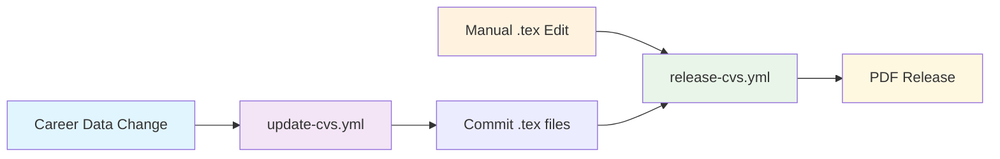

[](https://github.com/SchulteDev/SchulteDev/actions/workflows/update-cvs.yml)
[](https://github.com/SchulteDev/SchulteDev/actions/workflows/release-cvs.yml)

# Markus Schulte (Schulte development) CV Generation

AI-powered CV generation using Claude to transform career data into LuaLaTeX documents.

## Overview

Automated system that converts career data from [_data/career.md](../_data/career.md)
into CVs using Claude AI, with GitHub Actions for generation and PDF compilation.

## Architecture

### Two-Workflow System



- [update-cvs.yml](../.github/workflows/update-cvs.yml): AI transformation → .tex commits
- [release-cvs.yml](../.github/workflows/release-cvs.yml): PDF compilation → GitHub release

### Processing Modes

- **Incremental**: Processes git changes since last commit
- **Full rebuild**: Regenerates entire CV from career data

### CV Types

- **professional**: Traditional business format with quantified impact
- **anti**: Humorous format highlighting failures and lessons

## Local Testing

```bash
npm test                    # Basic test with mocks
CV_TYPES=anti npm test     # Test specific type
DRY_RUN=true npm test      # No file changes
```

## Environment

**Required**: `ANTHROPIC_API_KEY`  
**Optional**: `CV_TYPES`, `SKIP_API`, `DRY_RUN`, `GIT_DIFF_RANGE`
